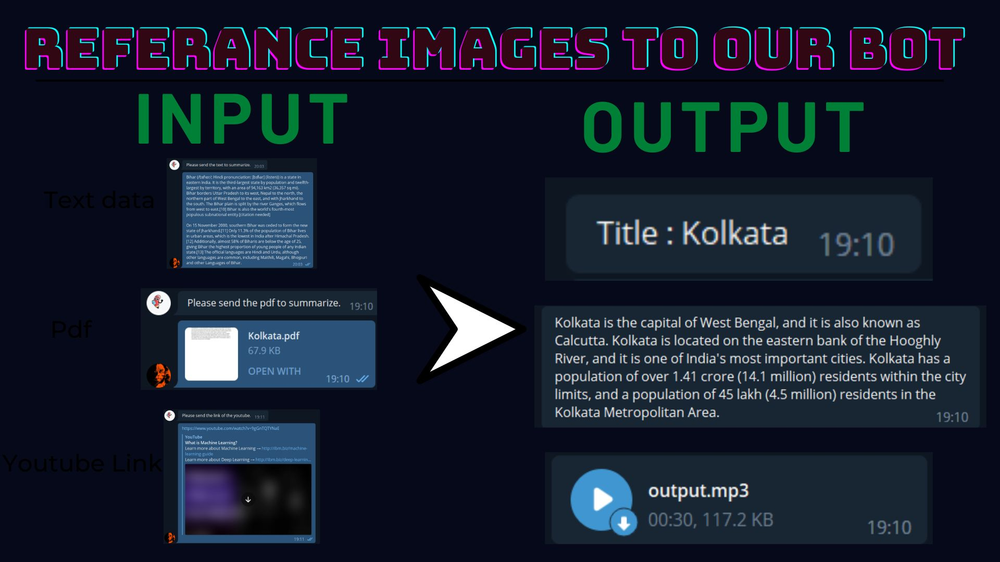

Skip to content
Search or jump to…
Pull requests
Issues
Codespaces
Marketplace
Explore
 
@Coderaman-tech 
Coderaman-tech
/
Saransh-The-Text-Summarizer-
Public
Code
Issues
Pull requests
Actions
Projects
Wiki
Security
Insights
Settings
Saransh-The-Text-Summarizer-
/
README.md
in
main
 

Spaces

1

Soft wrap
1
#  Saransh- Text Summarizer
2
​
3
</img><br>
4
​
5
In this project, we have made an automatic text summarizer which summarizes different types of text data sources.
6
​
7
 We made the telegram bot which is used to generate a summary of the text and provide a title and audio file for the same. Alternatively, if there are youtube video, PDFs, etc uploaded by the educator, the solution is able to summarize the large content into bite-sized information.
8
​
9
​
10
## API Reference
11
​
12
#### Get all items
13
​
14
```http
15
  https://openai.com/api/
16
```
17
​
18
| Parameter |Description                |
19
| :-------- |:------------------------- |
20
| `api_key` | **Required**. Your API key |
21
| `Bot_Token` | **Required** Telegram Bot Token |   
22
​
23
You need to import these libraries, if not downloaded use pip install
24
```bash
25
numpy
26
requests
27
convertapi
28
gtts
29
jsonpickle
30
nltk
31
openai
32
pdfplumber
33
pydaisi
34
PyPDF2
35
pyTelegramBotAPI
36
wget
37
youtube_transcript_api
38
```
39
 
40
​
41
#  Telegram bot
42
​
43
</img><br>
44
​
No file chosen
Attach files by dragging & dropping, selecting or pasting them.
Styling with Markdown is supported
@Coderaman-tech
Commit changes
Commit summary
Create README.md
Optional extended description
Add an optional extended description…
 Commit directly to the main branch.
 Create a new branch for this commit and start a pull request. Learn more about pull requests.
 
Footer
© 2022 GitHub, Inc.
Footer navigation
Terms
Privacy
Security
Status
Docs
Contact GitHub
Pricing
API
Training
Blog
About
